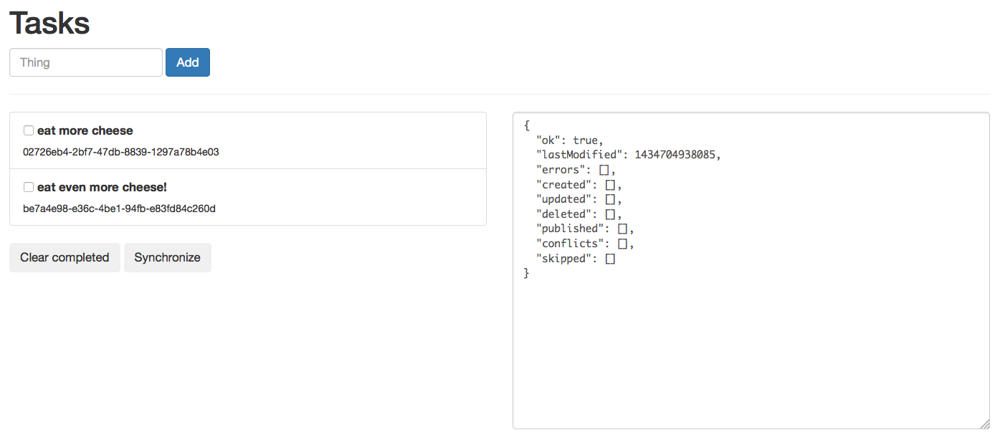
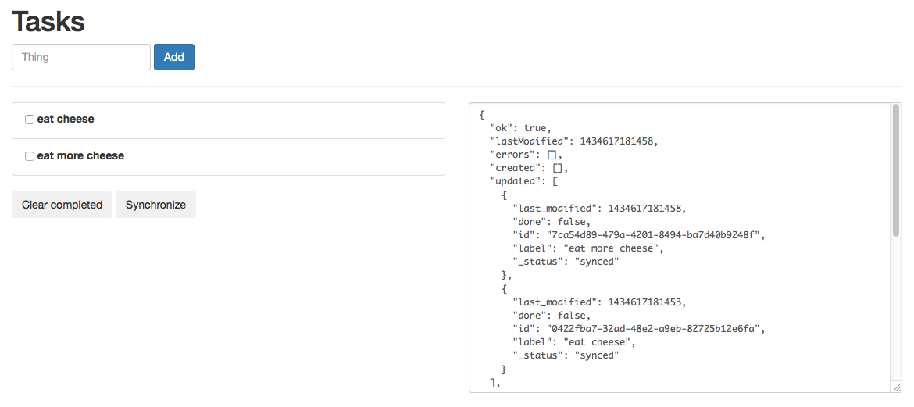

# Tutorial

We'll create a super simple offline-first, remotely synchronized todo list application, step-by-step. End result will look like this:



The final demo code is [available](https://github.com/mozilla-services/cliquetis/tree/master/demo) in the Cliquetis repository.

> #### Note:
>
> **For this tutorial we'll be using a public test server instance of [Kinto](http://kinto.readthedocs.org/); data stored on this instance are purged every 24 hours. Don't rely on this server for production use.**
>
> If you plan on using your own version of Kinto, please refer to the [setup instructions](http://kinto.readthedocs.org/en/stable/installation.html).

## Bootstrapping a demo Web application

First, let's create a simple HTML file for our demo app, in an `index.html` file:

```html
<!DOCTYPE html>
<html>
<head>
  <meta charset="utf-8">
  <title>Cliquetis demo</title>
  <link rel="stylesheet" href="https://maxcdn.bootstrapcdn.com/bootstrap/3.3.5/css/bootstrap.min.css">
</head>
<body>
  <div class="container">
    <h1>Tasks</h1>
    <form class="form-inline" id="form">
      <div class="form-group">
        <input class="form-control" type="text" name="label" placeholder="Thing">
        <input class="btn btn-primary" type="submit" value="Add">
      </div>
    </form>
    <hr>
    <ul id="tasks" class="list-group"></ul>
  </div>
  <script src="https://raw.githubusercontent.com/mozilla-services/cliquetis/master/dist/cliquetis.min.js"></script>
  <script src="demo.js"></script>
</body>
</html>
```

For now, our `demo.js` file content is simply:

```js
function main() {
  var db = new Cliquetis({remote: "https://kinto.dev.mozaws.net/v0"});
  var tasks = db.collection("tasks");
}

window.addEventListener("DOMContentLoaded", main);

```

> #### Notes
>
> - For convenience, we're using a mozilla-hosted version of Kinto at `https://kinto.dev.mozaws.net/v0`; **data pushed to this instance are reset everyday**;
> - You'll need to serve this page over HTTP, for Cliquetis to work. To do so, you can use node's [http-server](https://github.com/indexzero/http-server), Python's [SimpleHTTPServer](https://docs.python.org/2/library/simplehttpserver.html) or whatever Web server you like.

For example, if you're using http-server:

    $ pwd
    /home/niko/cliquetis-tutorial
    $ npm install -g http-server
    $ http-server /home/niko/cliquetis-tutorial

And that's it. You should see something like this on `http://localhost:3000`:


## Adding new tasks

We want to listen to form submission events to add tasks into our local database. In `demo.js`, we write:

```js
function main() {
  var db = new Cliquetis();
  var tasks = db.collection("tasks");

  document.getElementById("form")
    .addEventListener("submit", function(event) {
      event.preventDefault();
      tasks.create({
        label: event.target.label.value,
        done: false
      }).then(_ => {
        event.target.label.value = "";
        event.target.label.focus();
      }).catch(function(err) {
        console.error(err);
      });
    });
}

window.addEventListener("DOMContentLoaded", main);
```

Notice the call to `tasks.create()`, which returns a [Promise](https://developer.mozilla.org/fr/docs/Web/JavaScript/Reference/Objets_globaux/Promise).

If you try to add a task… well, nothing seems to happen. That's pretty much expected, as we're not displaying anything yet!

Though if you're using Firefox, open your [Developer Tools](https://developer.mozilla.org/en-US/docs/Tools) and head to the *Storage* tab; you should see some IndexedDB databases listed there, and should find you're recently created tasks. If the storage tab is missing, you need to enable "Storage" in the "Toolbox options" menu".:


You should now see a storage tab listing your added entries:


## Listing tasks

All that is great, though we badly want to render our list of tasks now. Let's do that by adding a few lines in our `demo.js` file:

```js
function main() {
  document.getElementById("form")
    .addEventListener("submit", function(event) {
      event.preventDefault();
      tasks.create({
        label: event.target.label.value,
        done: false
      }).then(function(res) {
        event.target.label.value = "";
        event.target.label.focus();
        // Render the list once a value had been submitted.
        render();
      }).catch(function(err) {
        console.error(err);
      });
    });

  function renderTask(task) {
    var li = document.createElement("li");
    li.classList.add("list-group-item");
    li.innerHTML = task.label;
    return li;
  }

  function renderTasks(tasks) {
    var ul = document.getElementById("tasks");
    ul.innerHTML = "";
    tasks.forEach(function(task) {
      ul.appendChild(renderTask(task));
    });
  }

  function render() {
    tasks.list().then(function(res) {
      renderTasks(res.data);
    }).catch(function(err) {
      console.error(err);
    });
  }

  render();
}

window.addEventListener("DOMContentLoaded", main);
```

Nothing fancy, this is mostly plain old DOM manipulation. Though the interesting bits here are:

- We now call `render()` as soon as the creation promise is resolved;
- The call to `tasks.list()` in `render()` which also returns a promise.

You should now see your added tasks:


Now, refresh the page; your data are still there, thank you [indexedDB](https://developer.mozilla.org/fr/docs/IndexedDB)!

Last, switch off your Internet connection, and try adding tasks. It still works, because we're offline first, remember. We'll get through synchronization a bit later.

> #### Notes
>
> - The Cliquetis API heavily relies on [Promises](https://developer.mozilla.org/en-US/docs/Mozilla/JavaScript_code_modules/Promise.jsm/Promise). Don't hesitate to learn a but more about them before digging further into this tutorial.


## Updating a task

Hey, is this a todo list or what? Where are my checkboxes? Okay, let's implement that.

First, let's move to using a `template` tag in our HTML document so we can define how a task looks like; Add this in your `index.html` file:

```html
  …
  <ul id="tasks" class="list-group"></ul>
  <template id="task-tpl">
    <li class="list-group-item">
      <label>
        <input class="done" type="checkbox">
        <span class="name"></span>
      </label>
    </li>
  </template>
  …
```

Our `renderTask()` function becomes:

```js
  function renderTask(task) {
    var tpl = document.getElementById("task-tpl");
    var li = tpl.content.cloneNode(true);
    li.querySelector(".title").textContent = task.label;
    li.querySelector(".done").checked = task.done;
    return li;
  }
```

You should get this:


But that's not enough. We need to listen to clicks made on the checkbox, so we can actually update the task status:

```js
  function renderTask(task) {
    var tpl = document.getElementById("task-tpl");
    var li = tpl.content.cloneNode(true);
    li.querySelector(".title").textContent = task.label;
    // retrieve a reference to the checkbox element
    var checkbox = li.querySelector(".done");
    // initialize it with task status
    checkbox.checked = task.done;
    // listen to clicks
    checkbox.addEventListener("click", function(event) {
      // prevent the click to actually toggle the checkbox
      event.preventDefault();
      // invert the task status
      task.done = !task.done;
      // update task status
      tasks.update(task).then(function(res) {
        // on success, re-render to actually reflect the checkbox states.
        render();
      }).catch(function(err) {
        console.error(err);
      });
    });
    return li;
  }
```

Yeah, that's a bunch of lines. I've added comments so you can figure out what's happening. But how powerful is this? Check/uncheck a bunch of tasks; refresh. Close Internet connection. Repeat. Feelings.

> #### Notes
>
> It's important to `catch()` promise rejection, so you are notified when something fails along the asynchonous chain; especially knowing that some browsers will silently ignore rejections.

## Deleting tasks

How about a button to clear all completed tasks? I know you waited for it.

First, let's add the button to the HTML document:

```html
…
<ul id="tasks" class="list-group"></ul>
<button id="clearCompleted" class="btn">Clear completed</button>
…
```

Then the JavaScript:

```js
  document.getElementById("clearCompleted")
    .addEventListener("click", function(event) {
      event.preventDefault();
      tasks.list()
        .then(function(res) {
          // Filter tasks according to their done status
          var completed = res.data.filter(function(task) {
            return task.done;
          });
          // Delete all completed tasks
          return Promise.all(completed.map(function(task) {
            return tasks.delete(task.id);
          }));
        })
        .catch(function(err) {
          console.error(err);
        })
        .then(render);
    });
```

## Synchronizing tasks

If you [installed Kinto](https://kinto.readthedocs.org/en/latest/installation.html), you should have a server instance running on `http://0.0.0.0:8888`, which is also the remote endpoint Cliquetis is configured to use by default.

If for some reason it's running on a different host/ip, you can override the default by passing a `remote` option to the `Cliquetis` constructor:

```js
function main() {
  var db = new Cliquetis({remote: "http://1.2.3.4:5678/v42"});
  var tasks = db.collection("tasks");
  // …
```

>#### Notes
>
>- We need to pass the API version as well, here `v42` for example;
>- In a near future the version to use will be retrieved automatically.

Synchronizing local data is done by calling the `#sync()` method on our collection. First things first, let's add a shiny *Synchronize* button to our HTML document, as well as a textarea to display synchronization results:

```html
<div class="row">
  <div class="col-md-6">
    <ul id="tasks" class="list-group"></ul>
    <button id="clearCompleted" class="btn">Clear completed</button>
    <button id="sync" class="btn">Synchronize</button>
  </div>
  <div class="col-md-6">
    <textarea id="results" class="form-control col-md-6" rows="10"></textarea>
  </div>
</div>
```

Now the JavaScript:

```js
document.getElementById("sync")
  .addEventListener("click", function(event) {
    event.preventDefault();
    tasks.sync({headers: {Authorization: "Basic " + btoa("user:pass")}})
      .then(function(res) {
        document.getElementById("results").value = JSON.stringify(res, null, 2);
        render();
      })
      .catch(function(err) {
        console.error(err);
      });
  });
```

> #### Notes
>
> - We're using Basic Auth mode for Kinto, so we need to pass an `Authorization` header as an option to `#sync()`.

If you click on the button, you should see the JSON synchronization result object in the textarea:



Here's a sample result object, so you can appreciate it all:

```json
{
  "ok": true,
  "lastModified": 1434617181458,
  "errors": [],
  "created": [],
  "updated": [
    {
      "last_modified": 1434617181458,
      "done": false,
      "id": "7ca54d89-479a-4201-8494-ba7d40b9248f",
      "label": "eat more cheese",
      "_status": "synced"
    },
    {
      "last_modified": 1434617181453,
      "done": false,
      "id": "0422fba7-32ad-48e2-a9eb-82725b12e6fa",
      "label": "eat cheese",
      "_status": "synced"
    }
  ],
  "deleted": [],
  "published": [
    {
      "last_modified": 1434617181453,
      "done": false,
      "id": "0422fba7-32ad-48e2-a9eb-82725b12e6fa",
      "label": "eat cheese",
      "_status": "synced"
    },
    {
      "last_modified": 1434617181458,
      "done": false,
      "id": "7ca54d89-479a-4201-8494-ba7d40b9248f",
      "label": "eat more cheese",
      "_status": "synced"
    }
  ],
  "conflicts": [],
  "skipped": []
}
```

Let's review the different result object properties:

- `ok`: this is set to false when any error or conflict has been encountered;
- `lastModified`: the collection lastest modification timestamp server returned;
- `errors`: the list of encountered error (eg. IndexedDB errors) encountered, if any;
- `created`: the list of records imported locally;
- `updated`: the list of records updated locally; in our case, the `_status` and `last_modified` values were updated;
- `deleted`: the list of records deleted locally;
- `published`: the list of records published remotely; here we see we successfully pushed our two local tasks to the server;
- `conflicts`: the list of conflicts encountered, if any (we'll see this in a minute);
- `skipped`: the list of skipped operations; for example, if we're trying to remotely delete a record which doesn't exist on the server, that information will be listed here.

## Handling conflicts

If the client and the server have different versions of a single record, it will be listed in the `conflicts` sync result property.

Let's create a conflict by:

- Marking a local task record as `done`;
- Updating the record on the server and alter its title; we'll use [httpie](https://github.com/jakubroztocil/httpie) to do so:

```
$ http -a user:pass PATCH :8888/v0/collections/tasks/records/c8d522b1-11bd-4c0a-ab34-a36c427e0530 label="eat even more cheese"
HTTP/1.1 200 OK
Access-Control-Expose-Headers: Backoff, Retry-After, Alert
Content-Length: 118
Content-Type: application/json; charset=UTF-8
Date: Thu, 18 Jun 2015 09:01:00 GMT
Server: waitress

{
    "done": false,
    "id": "c8d522b1-11bd-4c0a-ab34-a36c427e0530",
    "label": "eat even more cheese",
    "last_modified": 1434619745465
}
```

If we try to `#sync`, now we get a conflict:

```js
{
  "ok": false,
  "lastModified": 1434619745465,
  "errors": [],
  "created": [],
  "updated": [],
  "deleted": [],
  "published": [],
  "conflicts": [
    {
      "type": "incoming",
      "local": {
        "last_modified": 1434619634577,
        "done": true,
        "id": "c8d522b1-11bd-4c0a-ab34-a36c427e0530",
        "label": "eat even more cheese",
        "_status": "updated"
      },
      "remote": {
        "last_modified": 1434619745465,
        "done": false,
        "id": "c8d522b1-11bd-4c0a-ab34-a36c427e0530",
        "label": "eat even more cheese!"
      }
    }
  ],
  "skipped": []
}
```

The conflict entry is rather self-explanatory, though let's dig into the details:

- `type`: The conflict direction, either `incoming` or `outgoing`; here the conflict occured when trying to import the change from the server;
- `local`: The local record version;
- `remote`: The server record version.

Now it's up to you how you want to resolve the conflict; for exemple, you could:

- override the local version with the remote one;
- compare the `last_modified` values and decide what to do accordingly;
- pick the right fields from both versions;
- etc.

Your take really. Let's take the former approach:

```js
  function handleConflicts(conflicts) {
    // For each conflict, resolve it by picking the remote version
    return Promise.all(conflicts.map(function(conflict) {
      return tasks.resolve(conflict, conflict.remote);
    })).then(_ => tasks.sync());
  }

  document.getElementById("sync")
    .addEventListener("click", function(event) {
      event.preventDefault();
      tasks.sync({
        headers: {Authorization: "Basic " + btoa("user:pass")
      }})
        .then(function(res) {
          document.getElementById("results").value = JSON.stringify(res, null, 2);
          if (res.conflicts.length) {
            // Conflicts! let's handle'em
            return handleConflicts(res.conflicts);
          } else {
            return res;
          }
        })
        .catch(function(err) {
          console.error(err);
        })
        .then(render);
    });
```

We're using `#resolve()` to mark a conflict as resolved: it accepts a conflict object, and a resolution one; the latter is what will be updated locally and sent for resynchronization on a next call to `#sync()` — which is exactly what we're doing after we've resolved all our conflicts.

## Now what?

That's all folks. Now feel free to browse the [API documentation](api.md), report [an issue](https://github.com/mozilla-services/cliquetis/issues/new), learn ho to [contribute](hacking.md), but most of all: have fun.
